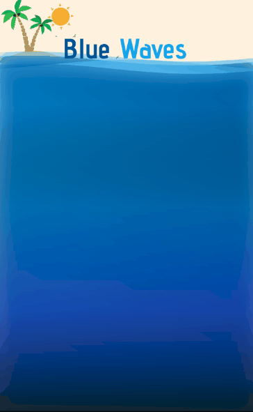

# Blue Waves Flutter

 
  API implementation with Flutter/Dart.

## Screenshots

## Features

- [x] Member registration.
- [ ] Paginated beach list.
- [ ] Add a new beach.
- [ ] Search a beach by name.
- [ ] Review a beach.
- [ ] Get best reviewed beaches.
>More features coming soon
